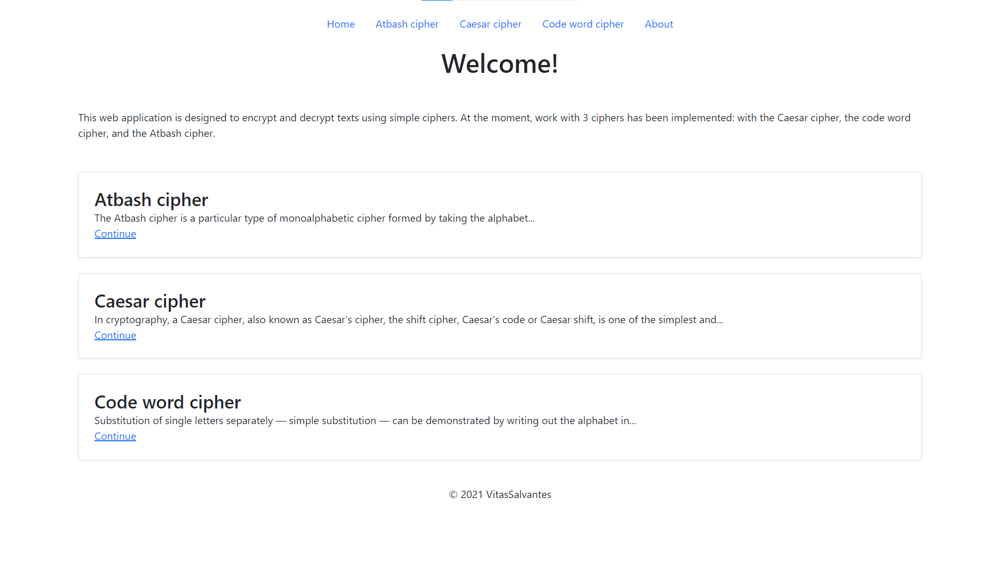
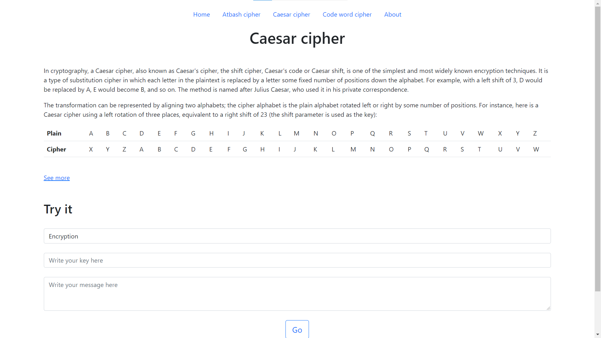
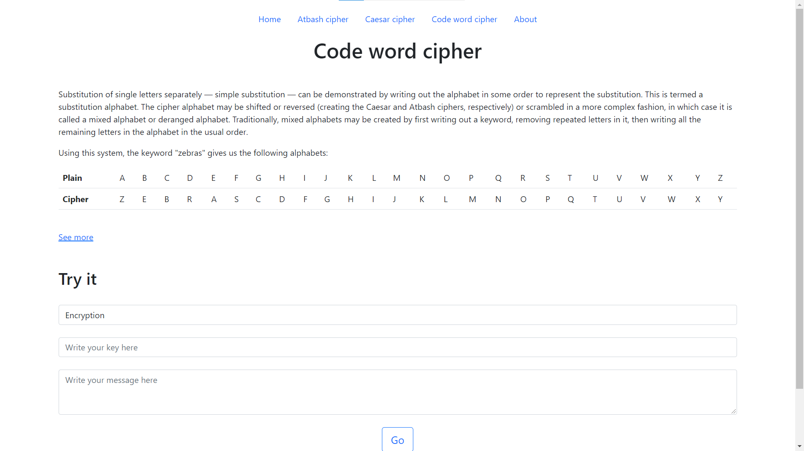

# Web-Krypto

This app was created to reinforce the material learned during [this](https://itproger.com/course/java-spring) course. I
learned the basics of developing Java applications using Spring Boot technology and developed my own project.

Development of the project began on **June 18, 2021**.

## Content ##

- [How does it work](#How-does-it-work)
- [Screenshots](#Screenshots)
- [Technologies](#Technologies)
- [Development progress](#Development-progress)
- [Project statistics](#Project-statistics)
- [How to install](#How-to-install)
- [How to contribute](#How-to-contribute)

## How does it work ##

This web application is designed to encrypt and decrypt texts using simple ciphers. At the moment, work with 3 ciphers
has been implemented: with the Caesar cipher, the code word cipher, and the Atbash cipher.

The first thing the user sees is the **home page**. It displays a short description of the web application and links to
cipher pages.

Then the user can go to one of the **cipher pages**. The user can read a detailed description of the cipher and encrypt
or decrypt any text, and then, on the **result page**, copy the result to the clipboard by clicking on the button.

If the user wants to learn more about the developers of this application, then he can go to the **about page** and get
the necessary information.

## Screenshots ##

*All screenshots are relevant for version 1.0*

Home page:

Atbash cipher page:

Caesar cipher page:

Code word cipher page:

Result page:

About page:

## Technologies ##

- The programming language Java ([AdoptOpenJDK version 11.0.10](https://adoptopenjdk.net/))
  and [Spring Boot](https://spring.io/projects/spring-boot#overview) were chosen for development.

- Development was carried out in [IntelliJ IDEA](https://www.jetbrains.com/idea/) Ultimate Edition (license for
  students).

- [Maven](https://maven.apache.org/) was used to build the project and inject dependencies.

- [Thymeleaf](https://www.thymeleaf.org/) was chosen as the template engine.

- [MySQL](https://www.mysql.com/de/) was chosen as the database. To run on a local server,
  the [MAMP](https://www.mamp.info/de/windows/) program was used.

- [Figma](https://www.figma.com/) was used to prototype the user interface.

- The app was designed using [Bootstrap](https://getbootstrap.com/).

- [WakaTime](https://wakatime.com/) was used to track activity.

- [Microsoft To Do](https://todo.microsoft.com/tasks/) was used to schedule tasks.

## Development progress ##

The application is under active development.

*Since I am developing this project mainly alone, I see no reason to use [Trello](https://trello.com/).*

## Project statistics ##

See more
on [WakaTime](https://wakatime.com/@9a3d815f-a717-4cd2-b355-b359c1e94cfd/projects/jofumsinqw?start=2021-06-20&end=2021-07-03)
.

*Activity tracking started on **July 1, 2021**.*

## How to install ##

At the moment, running the program on a user's computer is not supported due to the lack of a local database.

## How to contribute ##

If you want to take part in the development of this project, please
read [this](https://github.com/VitasSalvantes/Web-Krypto/blob/master/CONTRIBUTING.md) file.